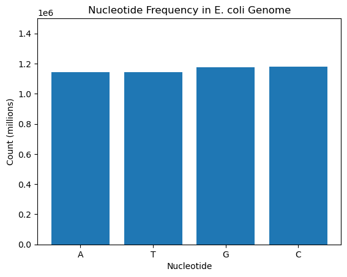

# DNA Sequence Analysis Tool  

## Overview  
A Python tool to analyze DNA sequences from NCBI FASTA files. Calculates GC content, nucleotide frequency, and transcribing DNA to RNA.  

## Installation  
1. Install [Anaconda](https://www.anaconda.com/products/distribution).  
2. Install libraries:  
   ```bash  
   pip install biopython numpy pandas matplotlib  
   ```  

## Usage  
1. Download a FASTA file from NCBI (e.g., E. coli genome).  
2. Run the Jupyter notebook `DNA_Sequence_Analysis.ipynb`.  

## Results  
- **GC Content**: 50.79%  
- **Nucleotide Frequency Plot**:  
  
- **First 50 RNA bases:** AGCUUUUCAUUCUGACUGCAACGGGCAAUAUGUCUCUGUGUGGAUUAAAA

## Skills Demonstrated  
- Python, Numpy, Pandas, Matplotlib, Biopython
